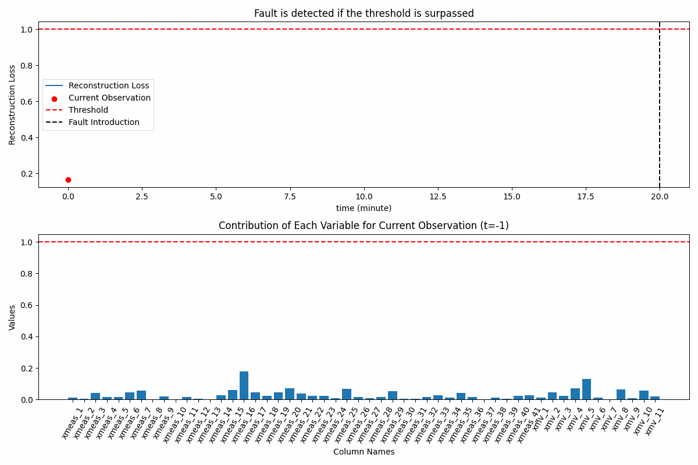

# Industrial Process Fault Detection Using Autoencoder (With Deployment)


Source:Google Cloud

## Motivation

The aim of this project is to create a reliable fault detection system for Industrial Processes. Through this code, we'll explore unsupervised machine learning method to identify unusual events and faults in the process. A key focus is deploying a neural network model on a server. By doing this, we can utilize real-time sensor readings from the system to promptly identify anomalies using the deployed neural network model.


## Technological Background
The primary technology employed in this project is the training of an Autoencoder model using exclusively normal data. The system is then monitored by examining the reconstruction loss. If the reconstruction loss surpasses a predefined threshold or becomes significantly high, a fault is identified.


## Requirements
- Python 3.10
- Pandas
- NumPy
- TensorFlow
- FastAPI
- Matplotlib
- Scikit-learn
- Seaborn

## Execution steps
Begin by cloning this GitHub repository to your local machine. Use the following command in your terminal or Git bash:
```bash
git clone https://github.com/mohan696matlab/TEP_Anomaly_detection_deployment.git
```

### Training the autoencoder model using only normal data and saving the model

Refer to the file `Training_AutoEncoder.ipynb`. It is well explained in my youtube channel [https://youtu.be/iCTU-IZ6rPQ?si=s9Y-SmCgq2EVVITW]

### Creating a FAST-API app for deployment of the model in local server

Refer to the file `Main.py`

### Running the Model on Local Server
To use the trained Autoencoder model, a FastAPI server is implemented. This server exposes an API endpoint for making predictions based on input features.

```bash
uvicorn Main:app --reload
```

### Performing Realtime monitoring of the process using live sensor data and the Autoencoder model present on the server

Refer to the file `Client_RealTime.ipynb`

### Obtained Results

The created model is able to identify fault very quickly after it was introduced. 

The reconstruction loss is normalized by division with the threshold, so the threshold becomes 1 and it is easier to interpret.

The contribution of all the variables towards the reconstruction loss is also given. It will help to identify the root cause of a fault in the system.




## Author
- Balyogi Mohan Dash (PhD candidate at University of Lille, France)
- https://www.linkedin.com/in/balyogi-mohan-dash/
- mohandash96@gmail.com

## Credits

- TEP Data [https://www.kaggle.com/datasets/averkij/tennessee-eastman-process-simulation-dataset/]
- Timur Bikmukhametov [https://www.linkedin.com/in/timurbikmukhametov/]
- Pau Labarta Bajo [https://www.linkedin.com/in/pau-labarta-bajo-4432074b/]
- Krish Naik [https://www.youtube.com/@krishnaik06]


